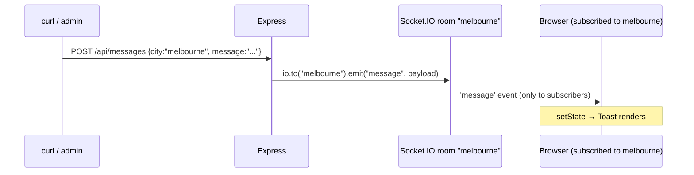

# Weather Live

A small React + Node app demonstrating real-time message delivery to WebSocket rooms keyed by city. Built as a coding challenge submission.


## Stack

- **Client**: React 18, Vite, TypeScript
- **Server**: Node.js, Express, Socket.IO, TypeScript
- **Auth**: JWT (jsonwebtoken), in-memory user store
- **Weather**: Open-Meteo API — no API key required
- **Validation**: Zod on all server request bodies and query params

## Setup

```bash
# Terminal 1 — server
cd server && npm install && cp .env.example .env && npm run dev

# Terminal 2 — client
cd client && npm install && npm run dev
```

Open [http://localhost:5173](http://localhost:5173).

## Demo credentials

`demo / demo` or `alice / alice123`

## Try it

Log in, select **Melbourne**. In a terminal:

```bash
# Push a message to Melbourne — toast appears within ~100ms
curl -X POST http://localhost:3001/api/messages \
  -H 'Content-Type: application/json' \
  -d '{"message": "Severe storm approaching", "city": "melbourne"}'

# The exclusion test — push to a city you're not subscribed to.
# The toast should NOT appear. recipients: 0 in the response confirms
# the message went to a room with no subscribers, not broadcast-with-filter.
curl -X POST http://localhost:3001/api/messages \
  -H 'Content-Type: application/json' \
  -d '{"message": "Air quality alert", "city": "sydney"}'
```

Both responses include a `recipients` field showing how many sockets received the message.

## Architecture

When a user selects a city, the client emits `joinCity` and the server joins that socket to a Socket.IO room keyed by the city slug (e.g. `"melbourne"`). The `POST /api/messages` endpoint targets that room directly — non-subscribers never see the event.



When the user switches cities, React's effect cleanup runs first — emitting `leaveCity('melbourne')` with the previous closure — before the new effect fires and emits `joinCity('sydney')`. The ordering is guaranteed by React's effect lifecycle, so the user is subscribed to exactly one city room at any point in time.

A separate effect handles reconnects — see Testing Notes.

## Project structure

```
weather-live/
├── server/
│   ├── src/
│   │   ├── auth/          — JWT helpers, in-memory user store
│   │   ├── routes/        — login, weather, messages
│   │   ├── socket/        — JWT handshake middleware
│   │   ├── data/          — curated city list
│   │   ├── types.ts       — Socket.IO event maps
│   │   └── index.ts       — Express + Socket.IO bootstrap
│   └── .env.example
└── client/
    ├── src/
    │   ├── pages/         — Login, Home
    │   ├── components/    — Toast, ToastContainer, ProtectedRoute, ConnectionStatus
    │   ├── hooks/         — useSocket, useMessages
    │   ├── context/       — AuthContext
    │   ├── api/           — fetch wrappers (auth, weather)
    │   ├── styles/        — global, login, home, toast
    │   └── types.ts       — mirrored client/server types
    └── vite.config.ts
```

## Trade-offs I made

- **Express over NestJS** — NestJS adds structure that pays off at scale; for a three-route API it's overhead with no payoff.
- **Open-Meteo over OpenWeatherMap** — no API key means a reviewer can clone and run with zero extra setup. The trade-off is less control over rate limits and response schema stability.
- **Curated city list over free-text geocoding** — deterministic slugs make room names predictable and keep the curl examples clean. A geocoding call would add latency and a second external dependency.
- **localStorage JWT over HttpOnly cookies** — localStorage is vulnerable to XSS; HttpOnly cookies are the correct production approach. Pragmatic for a local demo with no third-party scripts.
- **Type duplication between client and server** — a shared package would require a workspace build step that adds reviewer setup friction. Duplication is the honest trade-off at this scope.
- **No Docker** — a reviewer can run the project with two `npm` commands. Docker adds nothing here except a longer setup section.
- **In-memory storage** — the brief explicitly permitted in-memory; adding persistence would have been over-engineering. State is lost on restart; persistent storage is item 3 under What I'd add.

## What I'd add for production

- **bcrypt** for password hashing — plain-text passwords are acceptable only in a demo with no real users
- **Refresh tokens with rotation** — 8-hour JWTs require re-login; a refresh flow keeps sessions alive without compromising revocability
- **Persistent database** (Postgres + an ORM) — replaces the in-memory user store and message log
- **Rate limiting** on `POST /api/messages` — the push endpoint is unauthenticated by design; without rate limiting it's trivially abusable
- **Structured logging and observability** — OpenTelemetry traces across HTTP and Socket.IO events; currently there's no visibility into what rooms are active or how many messages are flowing
- **Automated tests** — Vitest unit tests for auth and weather logic, supertest for HTTP routes, Socket.IO multi-client integration tests for room targeting
- **HttpOnly cookies** for token storage — eliminates the XSS surface of localStorage
- **AbortController on weather fetches** — rapid city switching can trigger concurrent requests; the last response to arrive wins rather than the last request sent
- **Zod validation of Open-Meteo responses** — the upstream schema is trusted implicitly; a schema change would produce a silent runtime error rather than a clear failure
- **User registration flow** — currently users are hardcoded; a registration endpoint with email verification is the obvious next step

## Testing notes

Room targeting was verified manually with a three-terminal setup (server, browser session, curl). The verification matrix:

- Push to current city while subscribed → `recipients: 1`, toast received
- Push to a city the user is not subscribed to → `recipients: 0`, no toast
- Switch cities, push to old city → `recipients: 0`, no toast
- Push to new city → `recipients: 1`, toast received

Reconnect handling (Manager-level `reconnect` event + explicit room rejoin) is present in code but not testable through Vite's dev proxy, which doesn't recover from a backend that disappears mid-session. Behind a real reverse proxy (nginx, Caddy, AWS ALB) the WebSocket connection re-establishes cleanly when the backend recovers, which is what the reconnect handlers in the code are designed for.
