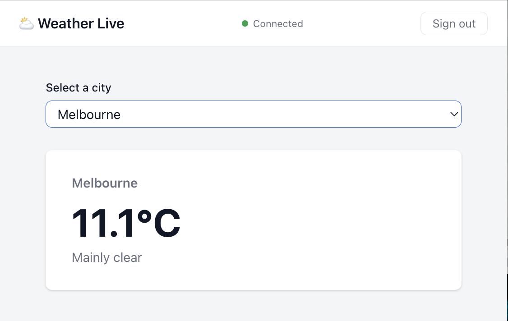
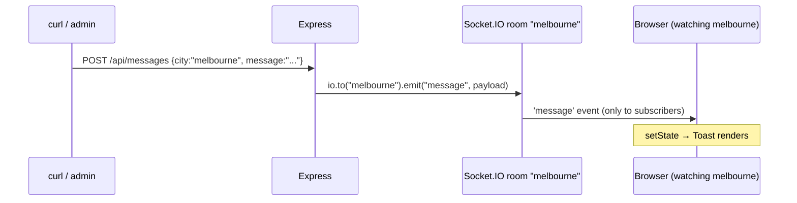
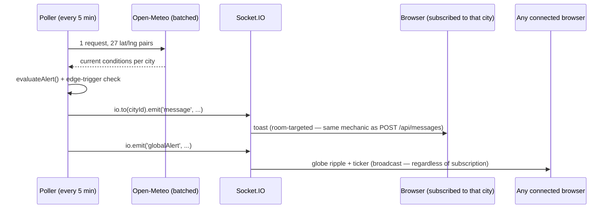

# Weather Live

**Live Global Weather Pulse** — an interactive 3D globe showing live conditions for 27 cities, with a server-side poller that detects severe weather in real time and pushes alerts over WebSocket rooms keyed by city. Started as a coding-challenge submission; grown into a portfolio piece.



## Stack

- **Client**: React 18, Vite, TypeScript, Three.js (globe)
- **Server**: Node.js, Express, Socket.IO, TypeScript, Vitest + Supertest
- **Auth**: JWT (jsonwebtoken), in-memory user store
- **Weather**: Open-Meteo API — no API key required, batched into one call per poll cycle for all 27 cities
- **Validation**: Zod on all server request bodies and query params

## Live Global Weather Pulse

There is no free, keyless, global severe-weather-alerts feed (Open-Meteo has none; NOAA is US-only; MeteoAlarm is Europe-only; OpenWeather/Xweather alerts are paid). So "real alerts" here means genuine automated detection over live data: a server-side poller (`server/src/weather/poller.ts`) fetches current conditions for all 27 cities in a single batched Open-Meteo request every `WEATHER_POLL_INTERVAL_MS` (default 5 minutes), evaluates each city against defined thresholds (`server/src/weather/alertRules.ts` — severe WMO codes, wind speed, precipitation rate, temperature extremes), and on an edge-triggered transition into `severe` fires two things:

- A room-targeted `message` event to that city's Socket.IO room — the same mechanic `POST /api/messages` always used, just triggered automatically instead of by curl.
- A global `globalAlert` broadcast to every connected client regardless of subscription, driving a ripple animation on the globe and a live ticker.

A third event, `weatherSnapshot`, broadcasts every poll cycle (not just on alerts) so the globe's city markers stay colored by current condition.

The globe (`client/src/three/globeScene.ts`) is Three.js: a textured sphere with a real-time day/night terminator computed from the actual subsolar point, camera-facing sprite markers per city, drag-to-rotate via `OrbitControls`, and click-to-select wired into the same `selectCity` flow the `<select>` dropdown uses (kept alongside the globe as the accessible/keyboard fallback — a globe click has no keyboard equivalent).

## Setup

```bash
# Terminal 1 — server
cd server && npm install && cp .env.example .env && npm run dev

# Terminal 2 — client
cd client && npm install && npm run dev
```

Open [http://localhost:5173](http://localhost:5173).

## Demo credentials

`demo / demo` or `alice / alice123` — or register a new account from the login page. Registered users are in-memory like everything else here: gone on server restart.

## Try it

Log in, select **Melbourne**. In a terminal:

```bash
# Push a message to Melbourne — toast appears within ~100ms
curl -X POST http://localhost:3001/api/messages \
  -H 'Content-Type: application/json' \
  -d '{"message": "Severe storm approaching", "city": "melbourne"}'

# The exclusion test — push to a city you're not subscribed to.
# The toast should NOT appear. recipients: 0 in the response confirms
# the message went to a room with no subscribers, not broadcast-with-filter.
curl -X POST http://localhost:3001/api/messages \
  -H 'Content-Type: application/json' \
  -d '{"message": "Air quality alert", "city": "sydney"}'
```

Both responses include a `recipients` field showing how many sockets received the message.

Both `POST /api/messages` and `POST /api/weather/poll-now` share a combined rate limit of 10 requests per minute per IP — they're the two unauthenticated-by-design endpoints, so this is the abuse-prevention floor for both together. Expect a `429` if you're scripting the curl examples in a loop.

To see the automated pipeline instead of a manual push, force a poll cycle against live Open-Meteo data:

```bash
curl -X POST http://localhost:3001/api/weather/poll-now
```

If nothing crosses a threshold (likely, on any given day), temporarily lower a value in `server/src/weather/alertRules.ts`'s `THRESHOLDS` and call it again — this exercises the real detection pipeline against real data, not a fabricated event. Lowering `WEATHER_POLL_INTERVAL_MS` in `.env` (e.g. to `20000`) is the same idea for the automatic cycle.

## Architecture

Rooms are a **watchlist**, not a single "current city." When a user views a city (via the globe, search, or the `<select>` fallback), the client emits `watchCity` and the server joins that socket to a Socket.IO room keyed by the city slug (e.g. `"melbourne"`) — without leaving any rooms it already occupies. The `POST /api/messages` endpoint targets a room directly — non-subscribers never see the event.



`useWatchlist` (`client/src/hooks/useWatchlist.ts`) owns room membership: it's persisted to `localStorage`, diffed on every add/remove to emit only `watchCity`/`unwatchCity` for the actual change, and fully re-joined on the socket's `connect`/`reconnect` events so a dropped connection doesn't silently lose alert coverage for cities watched before the bounce. Removing a city from the watchlist stops its alerts but doesn't affect what's currently shown in the detail panel — viewing and watching are related (viewing adds to the watchlist) but not the same state.

### Authentication

The JWT lives in an httpOnly cookie, not `localStorage` — JS (and therefore an XSS payload) genuinely cannot read it; `/login` and `/register` set it via `Set-Cookie` and never return it in the JSON body, since a token in the response body would defeat the point just as much as one in `localStorage` would.

Because the client can't read the cookie to know whether it's logged in, `GET /api/auth/me` exists purely to answer that question: it reads the cookie server-side, verifies the JWT, and returns the `userId` or 401. `AuthContext` calls it once on mount (`isLoading` covers that round trip — `ProtectedRoute` renders nothing until it resolves, rather than flashing a redirect to `/login` for an already-authenticated user) and again right after a successful login/register. `POST /api/auth/logout` clears the cookie server-side, since client-side JS can't delete an httpOnly cookie either.

The Socket.IO handshake reads the same cookie — `socket.handshake.headers.cookie`, parsed with the `cookie` package, since Engine.IO doesn't parse cookies itself — instead of the explicit `auth: { token }` payload the client used to send. The client connects with `io({ withCredentials: true })` so the browser attaches the cookie automatically; CORS on both the Express app and the Socket.IO server needs `credentials: true` alongside the (already-explicit, not wildcard) origin for that to work.

### The weather poller and its two broadcast channels

`server/src/weather/poller.ts` fetches all 27 cities in one batched Open-Meteo call, evaluates each against `alertRules.ts`, and tracks per-city severity in `alertState.ts` so a broadcast only fires on the *transition* into `severe` — not on every poll while conditions stay severe. Two distinct channels come out of this, deliberately kept separate:



A third event, `weatherSnapshot`, broadcasts every poll cycle (not just on alerts) so the globe's markers stay colored by current condition for every connected client.

Every triggered alert is also appended to `server/.data/alert-history.json` (capped at 100 entries) before it's broadcast, and served back via `GET /api/weather/alerts/history`. A freshly-loaded client — one that was never connected when an alert fired — hydrates its alert ticker from this endpoint on mount, deduplicating against anything that arrives live afterward by `cityId` + `timestamp`.

### Logging

The server logs structurally via `pino` (`server/src/logger.ts`) rather than `console.log`/`console.error` — every HTTP request (via `pino-http`), every socket connect/disconnect, every `watchCity`/`unwatchCity`, every message push (city + recipient count), and every poll cycle (cities polled, alerts triggered) is one structured line. `pino-pretty` (dev-only dependency) makes it human-readable during `npm run dev`; in production (`NODE_ENV=production`) it's raw newline-delimited JSON, which is what a real log aggregator would want. This is the "no visibility into what rooms are active or how many messages are flowing" gap closed at the logging layer — full distributed tracing across HTTP → Socket.IO → the poller would still need real OpenTelemetry spans, which is a bigger lift (see What I'd add for production).

## Project structure

```
weather-live/
├── server/
│   ├── src/
│   │   ├── auth/          — bcrypt + JWT helpers, in-memory user store
│   │   ├── routes/        — login/register/logout/me (httpOnly cookie auth), weather
│   │   │                    (cities/batch/poll-now/current/forecast/hourly/history/
│   │   │                    alerts), messages (+ supertest coverage for all)
│   │   ├── socket/        — cookie-reading JWT handshake middleware, watch/unwatch
│   │   │                    room handlers (+ real multi-client integration test)
│   │   ├── middleware/    — shared per-IP rate limiter (+ tests)
│   │   ├── data/          — curated city list
│   │   ├── weather/       — poller, batched Open-Meteo client + Zod response schemas,
│   │   │                    alert rules + state, disk-persisted alert history (+ tests)
│   │   ├── types.ts       — Socket.IO event maps
│   │   ├── logger.ts      — structured pino logger (pretty-printed in dev, JSON
│   │   │                    in production)
│   │   └── index.ts       — Express + Socket.IO bootstrap
│   ├── vitest.config.ts / vitest.setup.ts — sets JWT_SECRET before test imports run,
│   │                                        so npm test doesn't depend on a real .env
│   ├── vitest runs *.test.ts under src/; tsconfig.build.json excludes them from dist/
│   └── .env.example
└── client/
    ├── public/textures/   — Earth day/night/normal/specular maps (MIT, three.js examples)
    ├── src/
    │   ├── pages/         — Login, Home
    │   ├── components/    — Globe, AlertTicker, WeatherParticles, WeatherDetails,
    │   │                    WeatherInsights, HourlyForecast, ForecastStrip,
    │   │                    TrendSparkline, Sparkline, CitySearch, Watchlist,
    │   │                    SoundToggle, ThemeToggle, UnitToggle, ShareButton,
    │   │                    Toast, ToastContainer, ProtectedRoute, ConnectionStatus
    │   ├── three/         — geoMath (lat/lng↔sphere, subsolar point), weatherVisuals,
    │   │                    globeScene (imperative Three.js scene)
    │   ├── audio/         — soundscapeEngine (imperative Web Audio graph)
    │   ├── hooks/         — useSocket, useMessages, useWeatherSnapshot,
    │   │                    useGlobalAlerts, useWatchlist, useSoundscape, useTheme
    │   ├── context/       — AuthContext (isAuthenticated/isLoading via /api/auth/me;
    │   │                    no token — it's in an httpOnly cookie, invisible to JS),
    │   │                    UnitContext (°C/°F — data stays Celsius, converts at display)
    │   ├── api/           — fetch wrappers (auth, weather)
    │   ├── weatherInsights.ts, moonPhase.ts, formatLocalTime.ts — pure derived-
    │   │                    insight helpers shared between the on-page cards and
    │   │                    shareCard.ts (moonPhase kept import-free on purpose —
    │   │                    see trade-offs)
    │   ├── shareCard.ts   — draws the shareable snapshot PNG on an offscreen canvas
    │   ├── styles/        — global, login, home, toast, globe, alertTicker,
    │   │                    citySearch, watchlist, forecastStrip, hourlyForecast,
    │   │                    trendSparkline, weatherDetails, weatherInsights,
    │   │                    shareButton
    │   └── types.ts       — mirrored client/server types
    └── vite.config.ts
```

## Trade-offs I made

- **Express over NestJS** — NestJS adds structure that pays off at scale; for a three-route API it's overhead with no payoff.
- **Open-Meteo over OpenWeatherMap** — no API key means a reviewer can clone and run with zero extra setup. The trade-off is less control over rate limits and response schema stability.
- **Curated city list over free-text geocoding** — deterministic slugs make room names predictable and keep the curl examples clean. A geocoding call would add latency and a second external dependency.
- **No CSRF token scheme alongside the httpOnly cookie** — `sameSite: 'lax'` already blocks the classic cross-site-POST CSRF case, and this app has no authenticated state-changing REST endpoint to forge (`POST /api/messages` and `/poll-now` are deliberately unauthenticated ops routes; the only thing the cookie gates is the Socket.IO handshake, which isn't forgeable the way a hidden form submission is). A double-submit token would be defense with nothing to defend.
- **Type duplication between client and server** — a shared package would require a workspace build step that adds reviewer setup friction. Duplication is the honest trade-off at this scope.
- **No Docker** — a reviewer can run the project with two `npm` commands. Docker adds nothing here except a longer setup section.
- **In-memory storage** — the brief explicitly permitted in-memory; adding persistence would have been over-engineering. State is lost on restart; persistent storage is item 3 under What I'd add.
- **Derived alert thresholds over a real alerts feed** — no free/keyless global severe-weather-alerts API exists (checked: Open-Meteo, NOAA, MeteoAlarm, OpenWeather/Xweather). Thresholds in `alertRules.ts` are the honest alternative — genuine detection over real data, still no API key required.
- **In-memory alert-severity tracking** — resets on restart, same trade-off as the existing in-memory user store; a city that was mid-alert before a restart won't re-fire until conditions clear and recur.
- **Canvas2D particles, not a second Three.js scene** — the weather-card's rain/snow effect is plain canvas, keeping WebGL scoped to the globe only.
- **Committed textures over a fetch script** — ~1.5MB of Earth textures are committed directly to `client/public/`, consistent with the "no Docker, two npm commands" zero-setup philosophy above.
- **`Globe` is lazy-loaded, not the whole app** — Three.js is the bulk of this app's JS weight, but it's confined to one component; `weatherVisuals.ts`'s color helpers return plain hex strings rather than `THREE.Color` instances specifically so the components that render eagerly on the Home page (`Watchlist`, `ForecastStrip`) don't drag `three` into the main bundle. The result: `/login` and `/register` load a ~227KB bundle instead of ~775KB, and Three.js only downloads once a user is actually authenticated and viewing the globe.

## What I'd add for production

- **Refresh tokens with rotation** — 8-hour JWTs require re-login; a refresh flow keeps sessions alive without compromising revocability
- **Persistent database** (Postgres + an ORM) — replaces the in-memory user store and message log
- **Distributed tracing** (OpenTelemetry) — structured logging (below) covers "what's happening right now"; correlating a request across HTTP → Socket.IO → the poller would need real spans, which is a bigger lift
- **Fetch-mocked tests for the poller and the live-Open-Meteo routes** (`/api/weather`, `/forecast`, `/hourly`, `/history`) — same reasoning as the alert-threshold logic: mocking `fetch` is more effort than this portfolio-scale project needs when live curl checks already cover them each time they change
- **Email verification on registration** — `POST /api/auth/register` exists now (see below) but doesn't verify email ownership, since that needs real SMTP/third-party infrastructure to actually test end to end
- **A real database for alert history** — currently an append-to-disk JSON file (`server/.data/alert-history.json`, capped at 100 entries), which survives restarts but isn't queryable/filterable the way a real deployment would want

## Testing notes

Room targeting was verified manually with a three-terminal setup (server, browser session, curl). The verification matrix:

- Push to current city while subscribed → `recipients: 1`, toast received
- Push to a city the user is not subscribed to → `recipients: 0`, no toast
- Switch cities, push to old city → `recipients: 0`, no toast
- Push to new city → `recipients: 1`, toast received

Reconnect handling (Manager-level `reconnect` event + explicit room rejoin) is present in code but not testable through Vite's dev proxy, which doesn't recover from a backend that disappears mid-session. Behind a real reverse proxy (nginx, Caddy, AWS ALB) the WebSocket connection re-establishes cleanly when the backend recovers, which is what the reconnect handlers in the code are designed for.

The alert-threshold logic (`evaluateAlert`, `recordAndCheckEdge`), the Open-Meteo response schemas, and the HTTP routes with no external network dependency are unit/integration-tested — `cd server && npm test` (57 tests as of writing). The route tests use `supertest` against the real Express routers with dependencies stubbed at their existing factory boundaries — a mocked `io` for `messagesRouter` (covering the same subscribed/unsubscribed recipients matrix above, now automated), stub `getSnapshot`/`pollNow` functions for `weatherRouter`. `auth.test.ts` runs against the real `bcrypt`/JWT/cookie code paths (`JWT_SECRET` is set in `vitest.setup.ts` so tests don't depend on a real `.env` file existing) — since supertest doesn't manage a cookie jar across requests the way a browser does, a small helper extracts the raw `Set-Cookie` value from one response so a later request can `.set('Cookie', ...)` with it explicitly, covering `/login` → `/me` → `/logout` → `/me` round trips and asserting the `Set-Cookie` header actually carries `HttpOnly`. Routes that call live Open-Meteo (`/api/weather`, `/forecast`, `/hourly`, `/history`) are deliberately left out of the automated suite — same reasoning as the poller itself — and covered by live curl/browser checks instead whenever they change.

`server/src/socket/integration.test.ts` goes one step further than the mocked-`io` route tests: a real Socket.IO server on an ephemeral port, with real `socket.io-client` connections, verifying handshake auth (missing/invalid/valid token) and the actual room-targeting behavior — a message pushed to one city's room reaches only the client watching it, a client can watch multiple cities and receive alerts for either, and `unwatchCity` genuinely stops delivery. Node's `socket.io-client` has no browser cookie jar, so the token is attached via `extraHeaders: { Cookie: 'token=...' }` on connect, exercising the same `socket.handshake.headers.cookie` parsing path the real server uses. This is what the manual verification matrix above used to be the only coverage for.

The globe and poller were verified end-to-end with a headless-browser session: logged in, confirmed the globe renders 27 correctly-positioned markers (spot-checked against real geography — e.g. clicking the marker next to South America on the visible hemisphere selected Cape Town, consistent with Africa sitting just east of South America across the Atlantic at this rotation), clicked a marker and confirmed the weather card and `<select>` update in sync, confirmed zero console errors and zero failed asset/socket requests, and re-ran the original curl-based subscribed/unsubscribed toast test to confirm the poller changes didn't regress the existing room-targeting mechanic.

The httpOnly-cookie auth migration was verified with a battery of live browser checks: an unauthenticated visit to `/` redirects to `/login`; after login, `document.cookie` in the page's own JS context genuinely does not contain the token (proving `httpOnly` rather than just trusting the flag); the socket connects; a full page reload while authenticated stays on the home page (the `/api/auth/me` round trip working correctly, not just a one-time login flash); logout redirects to `/login` and a subsequent visit to `/` stays logged out (the cookie was actually cleared server-side, not just forgotten client-side); registration still auto-logs-in via the same cookie path; and the subscribed/unsubscribed toast test still passes after the Socket.IO handshake rewrite.
